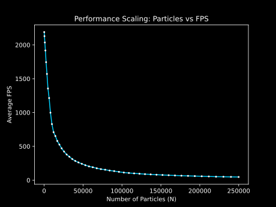
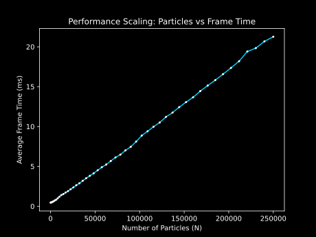

# Collision Simulator
An **OpenGL** based GPU accelerated 2D particle (circles) simulator which simulates real-time collisions amongst identical particles. 


##  Features
*   **Performance Metrics:** Real-time FPS counter displayed in the console, with average fps over a minute displayed at the end.
*   **Color Coding:** Particles are mapped to a color based on their speed
*   **Configurable Simulation Parameters:** Allows user to configure number of particles, radius of particles, coefficient of restitution and the resolution of particle.

## Demo Videos

<table>
  <tr>
    <td align="center">
      
      <br>
      <b>400 particles</b>
    </td>
    <td align="center">
      
      <br>
      <b>40,000 particles</b>
    </td>
  </tr>
</table>

> *Note: The frame rates observed in the demo videos are lower than the actual performance benchmarks due to the overhead of the screen recording software.*

## Performance Benchmarks

**System & Simulation Constants**
* **Renderer:** NVIDIA GeForce RTX 3050 6GB Laptop GPU/PCIe/SSE2
* **Resolution of particle:** 150
* **Coefficient of Restitution:** 1.0
* **Max particles per spatial grid cell:** 100
* **Test Duration:** 60s

<table>
  <tr>
    <td align="center">
      
      <br>
      <b>FPS v/s N</b>
    </td>
    <td align="center">
      
      <br>
      <b>Frame Time v/s N</b>
    </td>
  </tr>
</table>

<details>
<summary><b>Click to expand full benchmark data</b></summary>

| N (Particles) | Number of Cells | Max Velocity | Average FPS |
| ---: | ---: | ---: | ---: |
| 250,000 | 998,001 | 0.02 | 47.03 |
| 240,100 | 960,400 | 0.0204082 | 48.35 |
| 230,400 | 919,681 | 0.0208333 | 50.41 |
| 220,900 | 883,600 | 0.0212766 | 51.51 |
| 211,600 | 846,400 | 0.0217391 | 54.98 |
| 202,500 | 810,000 | 0.0222222 | 57.63 |
| 193,600 | 774,400 | 0.0227273 | 60.35 |
| 184,900 | 739,600 | 0.0232558 | 63.21 |
| 176,400 | 703,921 | 0.0238095 | 66.06 |
| 168,100 | 672,400 | 0.0243902 | 69.22 |
| 160,000 | 640,000 | 0.025 | 73.20 |
| 152,100 | 608,400 | 0.025641 | 76.57 |
| 144,400 | 576,081 | 0.0263158 | 80.45 |
| 136,900 | 547,600 | 0.027027 | 85.13 |
| 129,600 | 518,400 | 0.0277778 | 89.22 |
| 122,500 | 490,000 | 0.0285714 | 95.18 |
| 115,600 | 462,400 | 0.0294118 | 100.23 |
| 108,900 | 435,600 | 0.030303 | 106.33 |
| 102,400 | 409,600 | 0.03125 | 112.72 |
| 96,100 | 384,400 | 0.0322581 | 123.23 |
| 90,000 | 360,000 | 0.0333333 | 134.15 |
| 84,100 | 336,400 | 0.0344828 | 142.67 |
| 78,400 | 313,600 | 0.0357143 | 154.37 |
| 72,900 | 291,600 | 0.037037 | 163.17 |
| 67,600 | 270,400 | 0.0384615 | 176.10 |
| 62,500 | 249,001 | 0.04 | 190.98 |
| 57,600 | 229,441 | 0.0416667 | 203.88 |
| 52,900 | 211,600 | 0.0434783 | 221.57 |
| 48,400 | 193,600 | 0.0454545 | 241.87 |
| 44,100 | 175,561 | 0.047619 | 261.78 |
| 40,000 | 160,000 | 0.05 | 284.40 |
| 36,100 | 143,641 | 0.0526316 | 312.50 |
| 32,400 | 129,600 | 0.0555556 | 346.98 |
| 28,900 | 115,600 | 0.0588235 | 379.65 |
| 25,600 | 102,400 | 0.0625 | 422.62 |
| 22,500 | 90,000 | 0.0666667 | 470.63 |
| 19,600 | 78,400 | 0.0714286 | 526.33 |
| 16,900 | 67,600 | 0.0769231 | 579.43 |
| 14,400 | 57,121 | 0.0833333 | 653.00 |
| 12,100 | 48,400 | 0.0909091 | 709.77 |
| 10,000 | 40,000 | 0.1 | 829.35 |
| 8,100 | 32,400 | 0.111111 | 997.88 |
| 6,400 | 25,600 | 0.125 | 1214.35 |
| 4,900 | 19,600 | 0.142857 | 1355.40 |
| 3,600 | 14,161 | 0.166667 | 1570.80 |
| 2,500 | 10,000 | 0.2 | 1744.83 |
| 1,600 | 6,400 | 0.25 | 1917.93 |
| 900 | 3,481 | 0.333333 | 2035.90 |
| 400 | 1,600 | 0.5 | 2129.93 |
| 100 | 400 | 1 | 2189.80 |
</details>


##  Technical Details
*   **Collision Detection:** Implemented using spatial grid having roughly $O(n)$ time complexity for uniform distribution.
*   **Integration:** Euler integration.
*   **Rendering:** Instanced rendering using `glDrawArraysInstanced`. (Single draw call for all particles).
*   **Initialisation:** Particles are initialised on a grid with random velocities (adjustable range).
*   **GPGPU:** Implemented Compute shaders for GPU parallelism.
*   **Build System:** Configured with CMake to handle dependency management across environments.
*   **GPU Optimisation:** To make use of dedicated graphics card, `src/gpu_config.cpp` must be added to `add_executable` list in `CMakeLists.txt`.

##  Architecture Document
To understand the architecture of this project, read the  **[Architecture Document](https://arpit-shinde.github.io/Collision-Sim/)**.


## How to Build

Click the green `Code` button and copy the HTTPS URL. Open a folder in VS Code and run the following command in the terminal (make sure to have git installed):

```bash
git clone https://github.com/Arpit-Shinde/Collision-Sim.git
```

This will clone the repository. Once done, open the `Collision-Sim` folder in VS Code (`Ctrl+K+O`).

### Installing CMake

Run the following command (make sure your terminal is open in the `Collision-Sim` directory):

```bash
winget install Kitware.CMake
```

*Note: Reopen VS Code after running this command*

### Compiling the Project

Now, open the terminal in the working directory and run the following command to create a build folder:

```bash
mkdir build
```

Navigate to the newly created build folder:

```bash
cd build
```

Configure the project by running (Make sure MinGW is installed and added to PATH):

```bash
cmake .. -G "MinGW Makefiles"
```

After completion, build the executable with:

```bash
cmake --build .
```
### Running the Project
Once the build is complete, you will find the executable `Collision_Sim.exe` inside your build directory. You can launch it by double-clicking the file, or run it directly from your terminal.


